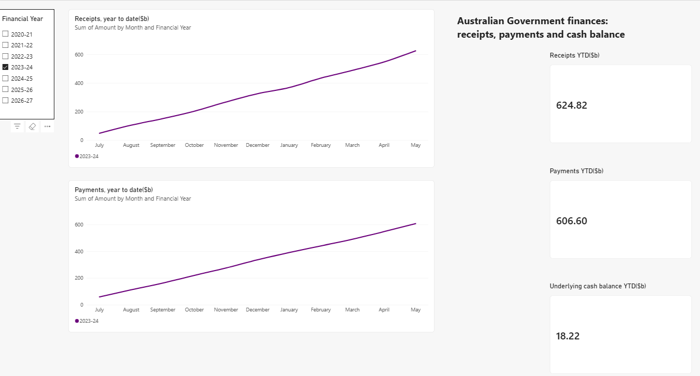

# Australian Government Finance Dashboard (Power BI)

A two-page Power BI dashboard that shows Australian Government receipts,
payments and the underlying cash balance from 2020-21 onward.

## Overview page

Pick a financial year to see receipts and payments month by month,
and the year-to-date totals.

## Yearly comparison page

## What the data shows

- 2020-21 had a very large deficit of about $125 billion to May, during COVID.
- The deficit fell to about $33 billion in 2021-22.
- 2022-23 and 2023-24 were in surplus. In 2022-23 the surplus was $19 billion to May.
- 2025-26 is back in deficit, about $11 billion to May.

## What I did

- **Power Query:** the source workbook has one sheet per financial year.
  I combined the sheets into one table with one row per measure and month.
- **DAX:** the figures are year-to-date running totals, so adding months
  together gives a wrong answer. I wrote a measure that returns the value
  of the latest available month:

      Latest YTD =
      VAR LatestMonth = MAX ( Aggregates[Month Number] )
      RETURN
          CALCULATE (
              SUM ( Aggregates[Amount] ),
              Aggregates[Month Number] = LatestMonth
          )

- **Checks:** I tested the cash balance card against receipts minus payments
  for two different years.

## Data

Australian Government general government sector monthly financial statements,
aggregates workbook (`6_-aggregates.xlsx`). All amounts are in $ billion.
2026-27 covers July and August only.

## Files

- `[your file name].pbix` – the Power BI report
- `6_-aggregates.xlsx` – source data
- `overview.png`, `yearly-comparison.png` – screenshots
